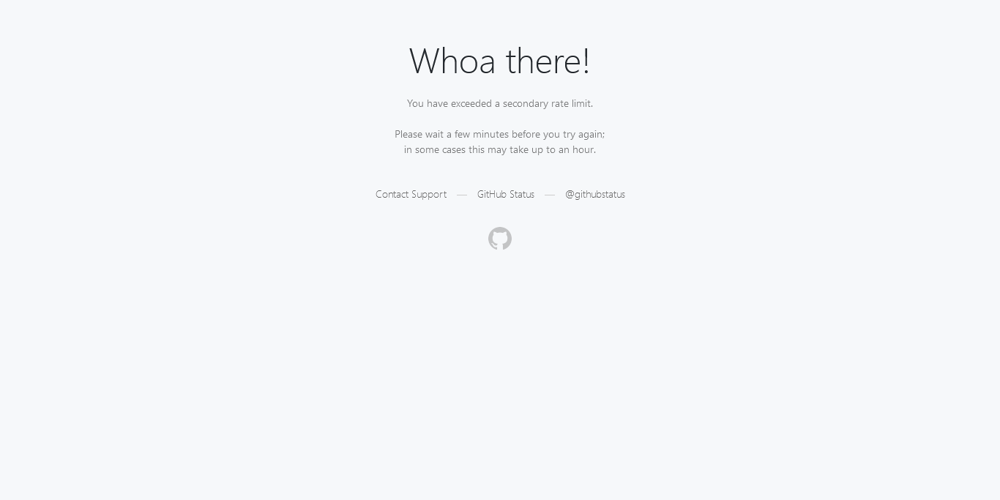

This is a use of:
https://github.com/mherrmann/helium
https://github.com/mherrmann/helium/blob/master/docs/cheatsheet.md

Webdriving is hard.. this does seem easier at first glance.  Github seems to rate-limit, so I need to figure out how to slow it down.

First attempt does save a screenshot
```
python -m venv venv
venv\Source\activate
python first.py
```
